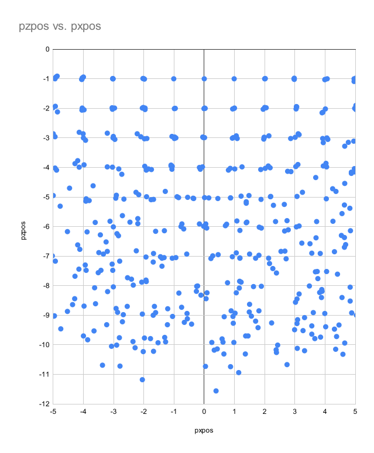
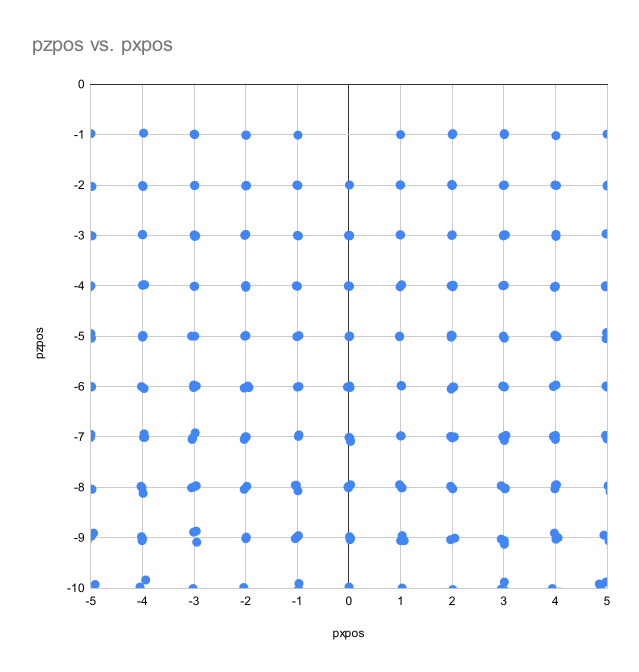

# CV1: Vision experiments

The general idea is to use cameras, low-tech OpenCV code, and conventional FRC known-location
retroreflective targets to generate pose estimates appropriate for correcting a Kalman filter
used for navigation.

It would be best if the pose estimates were accurate enough for trajectory planning and
correction appropriate to typical FRC games, which comprise two distinct scenarios:

* Navigating to within a few centimeters for close targets.
  Think of the hatch-panel targets in 2019, they could be used all the way to end-effector location.
* Location-finding to within a meter or so, for targeting projectiles.
  Think of the 2022 "hub" target or the 2013 frisbee target.

The FRC game is a much simpler vision challenge than most folk work on: the camera tilt is usually
fixed, the target geometry is known, the robot has only three degrees of freedom (x, y, azimuth).

I tried several approaches, all using WPI-Lib OpenCV Java API, which is OpenCV version 4.5.2 at the
moment.

# Monocular PnP.

This was disappointing, for geometric reasons: even at unrealistically high resolution, viewing a
target head-on yields only range; there's no way to get precision in the parallel direction, or
in azimuth.  This solution also involves way too many degrees of freedom, and uses them to introduce
errors (e.g. robot below the floor).

TODO: add some example code pointers.

# Binocular triangulation, followed by solve.

Complain here

# Binocular affine transform estimation

The 4.5.4 version of OpenCV includes Omeyama's algorithm for 3d rigid-body transform estimation, which
imposes some constraints on the general problem, e.g. rotations only, unit scaling.  Ultimately it
is simply SVD underneath.  :-)  I ported the OpenCV code to Java and tried it; it does improve on the
general triangulation solution, but it's still not great.  It still involves six degrees of freedom,
but the physical problem only involves three.

# Two-dimensional triangulation

Above I've been trying to find the transformation representing the camera pose:

$$
\begin{bmatrix}
\mathbf{R} \vert t
\end{bmatrix}=
\begin{bmatrix}
r_{11} & r_{12} & r_{13} & t_x\\
r_{21} & r_{22} & r_{23} & t_y\\
r_{31} & r_{32} & r_{33} & t_z\\
0      & 0      & 0      & 1
\end{bmatrix}
$$

Using the projection equation for each eye:

$$
x = K P T_{left} X
$$

$$
x' = K P T_{right} X
$$

Where the eye transforms are translations in camera frame:

$$
T_{left} =
\begin{bmatrix}
1 & 0 & 0 & \frac{b}{2}\\
0 & 1 & 0 & 0\\
0 & 0 & 1 & 0\\
0 & 0 & 0  & 1
\end{bmatrix}
$$

and

$$
T_{right} =
\begin{bmatrix}
1 & 0 & 0 & -\frac{b}{2}\\
0 & 1 & 0 & 0\\
0 & 0 & 1 & 0\\
0 & 0 & 0  & 1
\end{bmatrix}
$$

Expanding:

$$
s
\begin{pmatrix}
u \\\ v\\\1
\end{pmatrix}=
\begin{bmatrix}
f & 0 & c_x \\
0 & f & c_y \\
0 & 0 & 1
\end{bmatrix}
\times
\begin{bmatrix}
1 & 0 & 0 & 0 \\
0 & 1 & 0 & 0 \\
0 & 0 & 1 & 0
\end{bmatrix}
\times
\begin{bmatrix}
1 & 0 & 0 & \frac{b}{2}\\
0 & 1 & 0 & 0\\
0 & 0 & 1 & 0\\
0 & 0 & 0 & 1
\end{bmatrix}
\times
\begin{bmatrix}
r_{11} & r_{12} & r_{13} & t_x\\
r_{21} & r_{22} & r_{23} & t_y\\
r_{31} & r_{32} & r_{33} & t_z\\
0    & 0    & 0    & 1
\end{bmatrix}
\times
\begin{pmatrix}
X \\\ Y \\\ Z \\\ 1
\end{pmatrix}
$$

...and similarly for the right eye.  So, twelve variables.  Triangulation in 3d is hard, most lines are skew lines.

But the physical problem is only two-dimensional; we don't want any rotation about the X or Z axes, nor any translation in Y.  And in 2d,
every triangulation is solvable exactly.

So discard the Y/v data, and find this instead:

$$
\begin{bmatrix}
\mathbf{R} \vert t
\end{bmatrix}=
\begin{bmatrix}
r_{11} & r_{12} & t_x\\
r_{21} & r_{22} & t_z\\
0      & 0      & 1
\end{bmatrix}
$$

Using a 2d version of the projection equation, for example for the left eye:

$$
s
\begin{pmatrix}
u \\\1
\end{pmatrix}=
\begin{bmatrix}
f & c_x \\
0 & 1
\end{bmatrix}
\times
\begin{bmatrix}
1 & 0 & 0 \\
0 & 1 & 0
\end{bmatrix}
\times
\begin{bmatrix}
1 & 0 & \frac{b}{2}\\
0 & 1 & 0\\
0 & 0 & 1
\end{bmatrix}
\times
\begin{bmatrix}
r_{11} & r_{12} & t_x\\
r_{11} & r_{22} & t_z\\
0      & 0      & 1
\end{bmatrix}
\times
\begin{pmatrix}
X \\\ Z \\\ 1
\end{pmatrix}
$$

We can combine the right and left eyes into a single expression:

$$
s
\begin{pmatrix}u\\
u'\\
1\end{pmatrix}=
\begin{bmatrix}
f & 0 & c_x \\
0 & f & c_x \\
0 & 0 & 1
\end{bmatrix}
\times
\begin{bmatrix}
1 & 0 & \frac{b}{2}\\
1 & 0 & -\frac{b}{2}\\
0 & 1 & 0
\end{bmatrix}
\times
\begin{bmatrix}
r_{11} & r_{12} & t_x\\
r_{11} & r_{22} & t_z\\
0      & 0      & 1
\end{bmatrix}
\times
\begin{pmatrix}
X \\\ Z \\\ 1
\end{pmatrix}
$$

We'd actually like to further constrain the transformation suggestively notated as $r_{mn}$ to be a rotation, so there would only be
three variables, not six.

To solve this equation, I tried two methods. First, I cast the problem as $Ax=b$ and used the SVD method contained in the OpenCV function
`Core.solve(x, b, A, Core.DECOMP_SVD)`.

To cast the above equation as $Ax=b$ we first need to isolate the $A$ matrix we want to solve for:

$$
\begin{bmatrix}
f & 0 & c_x \\
0 & f & c_x \\
0 & 0 & 1
\end{bmatrix}^{-1}
\times
s
\begin{pmatrix}u\\
u'\\
1\end{pmatrix}=
\begin{bmatrix}
f & 0 & c_x \\
0 & f & c_x \\
0 & 0 & 1
\end{bmatrix}^{-1}
\begin{bmatrix}
f & 0 & c_x \\
0 & f & c_x \\
0 & 0 & 1
\end{bmatrix}
\times
\begin{bmatrix}
1 & 0 & \frac{b}{2}\\
1 & 0 & -\frac{b}{2}\\
0 & 1 & 0
\end{bmatrix}
\times
\begin{bmatrix}
r_{11} & r_{12} & t_x\\
r_{11} & r_{22} & t_z\\
0      & 0      & 1
\end{bmatrix}
\times
\begin{pmatrix}
X \\\ Z \\\ 1
\end{pmatrix}
$$

Simplifying:

$$
s
\begin{bmatrix}
f & 0 & c_x \\
0 & f & c_x \\
0 & 0 & 1
\end{bmatrix}^{-1}
\times
\begin{pmatrix}u\\
u'\\
1\end{pmatrix}=
\begin{bmatrix}
1 & 0 & \frac{b}{2}\\
1 & 0 & -\frac{b}{2}\\
0 & 1 & 0
\end{bmatrix}
\times
\begin{bmatrix}
r_{11} & r_{12} & t_x\\
r_{11} & r_{22} & t_z\\
0      & 0      & 1
\end{bmatrix}
\times
\begin{pmatrix}
X \\\ Z \\\ 1
\end{pmatrix}
$$

And again:

$$
s
\begin{bmatrix}
1 & 0 & \frac{b}{2}\\
1 & 0 & -\frac{b}{2}\\
0 & 1 & 0
\end{bmatrix}^{-1}
\times
\begin{bmatrix}
f & 0 & c_x \\
0 & f & c_x \\
0 & 0 & 1
\end{bmatrix}^{-1}
\times
\begin{pmatrix}u\\
u'\\
1\end{pmatrix}=
\begin{bmatrix}
1 & 0 & \frac{b}{2}\\
1 & 0 & -\frac{b}{2}\\
0 & 1 & 0
\end{bmatrix}^{-1}
\times
\begin{bmatrix}
1 & 0 & \frac{b}{2}\\
1 & 0 & -\frac{b}{2}\\
0 & 1 & 0
\end{bmatrix}
\times
\begin{bmatrix}
r_{11} & r_{12} & t_x\\
r_{11} & r_{22} & t_z\\
0      & 0      & 1
\end{bmatrix}
\times
\begin{pmatrix}
X \\\ Z \\\ 1
\end{pmatrix}
$$

Which yields:

$$
s
\begin{bmatrix}
1 & 0 & \frac{b}{2}\\
1 & 0 & -\frac{b}{2}\\
0 & 1 & 0
\end{bmatrix}^{-1}
\times
\begin{bmatrix}
f & 0 & c_x \\
0 & f & c_x \\
0 & 0 & 1
\end{bmatrix}^{-1}
\times
\begin{pmatrix}u\\
u'\\
1\end{pmatrix}=
\begin{bmatrix}
r_{11} & r_{12} & t_x\\
r_{11} & r_{22} & t_z\\
0      & 0      & 1
\end{bmatrix}
\times
\begin{pmatrix}
X \\\ Z \\\ 1
\end{pmatrix}
$$

And thus $Ax=b$:

$$
\begin{bmatrix}
r_{11} & r_{12} & t_x\\
r_{11} & r_{22} & t_z\\
0      & 0      & 1
\end{bmatrix}
\times
\begin{pmatrix}
X \\\ Z \\\ 1
\end{pmatrix}=
s
\begin{bmatrix}
1 & 0 & \frac{b}{2}\\
1 & 0 & -\frac{b}{2}\\
0 & 1 & 0
\end{bmatrix}^{-1}
\times
\begin{bmatrix}
f & 0 & c_x \\
0 & f & c_x \\
0 & 0 & 1
\end{bmatrix}^{-1}
\times
\begin{pmatrix}u\\
u'\\
1\end{pmatrix}
$$

I tried solving this system a very large simulated 2x2 meter target using a grid of poses
from 1 to 10 meters Z, -5 to 5 meters X, and +/- 67 degrees, with 1 pixel of noise, using the 
a relatively wide lens (120 degrees horizontal) and resolution 1280x800.  This yields accuracy as follows:

| measure | RMSE |
| --- | --- |
| pan | 7.1 degrees |
| X position | 1.1 meters |
| Z position | 0.39 meters |
| relative bearing | 0.092 degrees |
| range | 0.12 meters |

The X and Z accuracy is quite good within a few meters of the target; less good past about 5 meters.  The relative bearing accuracy is phenomenal no matter the range.  The X error exhibits the same shape as the PnP estimates: more than 5 or 6 meters away from the target, there is little 

Running again using a more realistic target size of 0.4 x 0.1 meters, and using the narrower 2.8mm lens as supplied with
the [Arducam OV9281 global shutter binocular setup](https://www.arducam.com/product/arducam-1mp2-stereoscopic-camera-bundle-kit-for-raspberry-pi-nvidia-jetson-nano-xavier-nx-two-ov9281-global-shutter-monochrome-camera-modules-and-camarray-stereo-camera-hat/),
over the same large (10x10 meter) yields much
worse X/Y accuracy, though still excellent bearing/range accuracy.

| measure | RMSE |
| --- | --- |
| pan | 14 degrees |
| X position | 2.1 meters |
| Z position | 0.79 meters |
| relative bearing | 0.02 degrees |
| range | 0.057 meters |

# Binocular 2d Omeyama method

I also tried a 2d adaptation of the Omeyama method, which yields essentially the same result as the 2d solver, above.

# Including Y

As an aside, instead of dropping Y, we could take advantage of the target geometry where Y is a constant, and we'd have this:

$$
s
\begin{pmatrix}
u \\\ u' \\\ v \\\ 1
\end{pmatrix}=
\begin{bmatrix}
f & 0 & 0 & c_x \\
0 & f & 0 & c_x \\
0 & 0 & f & c_y \\
0 & 0 & 0 & 1
\end{bmatrix}
\times
\begin{bmatrix}
1 & 0 & \frac{b}{2}\\
1 & 0 & -\frac{b}{2}\\
0 & 0 & Y \\
0 & 1 & 0
\end{bmatrix}
\times
\begin{bmatrix}
r_{11} & r_{12} & t_x\\
r_{11} & r_{22} & t_z\\
0      & 0      & 1
\end{bmatrix}
\times
\begin{pmatrix}
X \\\ Z \\\ 1
\end{pmatrix}
$$

I'm not sure that would be better, but I could measure that.

# Constrained 3d solver

Rather than try to use an overly-general canned solver, or split up Y and XZ, we could solve the full system with constraints.

The system for both eyes including Y:

$$
s
\begin{pmatrix}
u \\\ u' \\\ v \\\ 1
\end{pmatrix}=
\begin{bmatrix}
f & 0 & 0 & c_x \\
0 & f & 0 & c_x \\
0 & 0 & f & c_y \\
0 & 0 & 0 & 1
\end{bmatrix}
\times
\begin{bmatrix}
1 & 0 & 0 & 0 & 0 \\
0 & 1 & 0 & 0 & 0 \\
0 & 0 & 1 & 0 & 0 \\
0 & 0 & 0 & 1 & 0
\end{bmatrix}
\times
\begin{bmatrix}
1 & 0 & 0 & \frac{b}{2} \\
1 & 0 & 0 & -\frac{b}{2} \\
0 & 1 & 0 & 0 \\
0 & 0 & 1 & 0 \\
0 & 0 & 0 & 1
\end{bmatrix}
\times
\begin{bmatrix}
r_{11} & r_{12} & r_{13} & t_x\\
r_{21} & r_{22} & r_{23} & t_y\\
r_{31} & r_{32} & r_{33} & t_z\\
0    & 0    & 0    & 1
\end{bmatrix}
\times
\begin{pmatrix}
X \\\ Y \\\ Z \\\ 1
\end{pmatrix}
$$

Let's make that middle thing square:

$$
s
\begin{pmatrix}
u \\\ u' \\\ v \\\ 1
\end{pmatrix}=
\begin{bmatrix}
f & 0 & 0 & c_x \\
0 & f & 0 & c_x \\
0 & 0 & f & c_y \\
0 & 0 & 0 & 1
\end{bmatrix}
\times
\begin{bmatrix}
1 & 0 & 0 & \frac{b}{2} \\
1 & 0 & 0 & -\frac{b}{2} \\
0 & 1 & 0 & 0 \\
0 & 0 & 1 & 0
\end{bmatrix}
\times
\begin{bmatrix}
r_{11} & r_{12} & r_{13} & t_x\\
r_{21} & r_{22} & r_{23} & t_y\\
r_{31} & r_{32} & r_{33} & t_z\\
0    & 0    & 0    & 1
\end{bmatrix}
\times
\begin{pmatrix}
X \\\ Y \\\ Z \\\ 1
\end{pmatrix}
$$

Then we can invert everything and rearrange as Ax=b:

$$
\begin{bmatrix}
r_{11} & r_{12} & r_{13} & t_x\\
r_{21} & r_{22} & r_{23} & t_y\\
r_{31} & r_{32} & r_{33} & t_z\\
0    & 0    & 0    & 1
\end{bmatrix}
\times
\begin{pmatrix}
X \\\ Y \\\ Z \\\ 1
\end{pmatrix}=
s
\begin{bmatrix}
1 & 0 & 0 & \frac{b}{2} \\
1 & 0 & 0 & -\frac{b}{2} \\
0 & 1 & 0 & 0 \\
0 & 0 & 1 & 0
\end{bmatrix}^{-1}
\times
\begin{bmatrix}
f & 0 & 0 & c_x \\
0 & f & 0 & c_x \\
0 & 0 & f & c_y \\
0 & 0 & 0 & 1
\end{bmatrix}^{-1}
\times
\begin{pmatrix}
u \\\ u' \\\ v \\\ 1
\end{pmatrix}
$$

To solve this system, find the difference in $x$ and $b$ centroids: this is the $t$ vector.
Then measure the angle in the XZ plane of each point with respect to its centroid.
The average difference in angle between $x$ and $b$ is the rotation $R$.

This method yielded results about the same as the other methods above: unusable past a few meters,
especially directly in front of the target, and the reason is the same: the camera view of the
target is the cosine, which has no sensitivity around zero.

# A Good Solution: Reference the IMU

The cartesian accuracy is low, but the camera-centric polar accuracy is extremely good, especially
the relative-bearing accuracy, which makes sense: relative bearing is the most direct measurement
a camera can make.  How can we take advantage of that accuracy?

Instead of deriving the heading from the camera, we can use the IMU heading.  The solution is
literally to use the above method but replace the angle differencing with the IMU heading.  The
difference in centroids is a good XZ estimate in camera coordinates, and the IMU heading permits
accurate transformation into world coordinates.

The common FRC IMUs claim about 1.5 degree accuracy.  The LIS3MDL sensor I've been using is
quite a bit better, about 0.5 degrees.  Averaging down to 10 Hz yields a cartesian RMSE of 4 cm:

These results are acceptable for global navigation.
