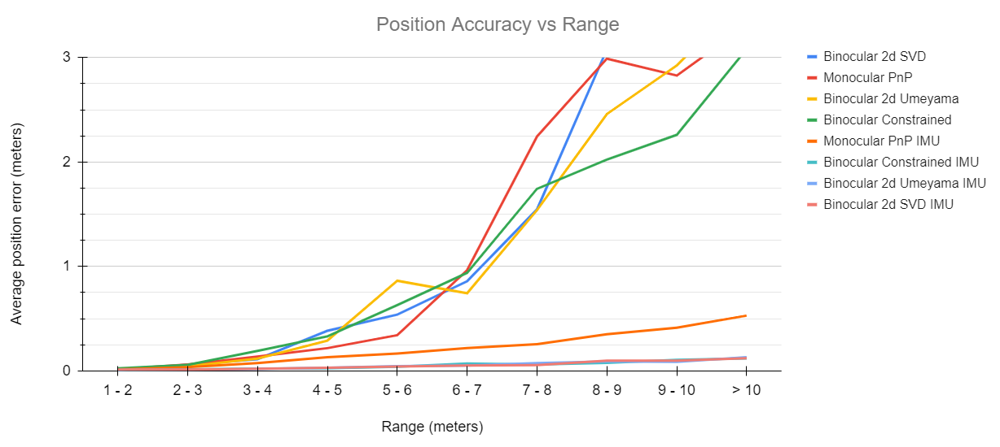

I compared various pose estimation methods and obtained the following, in increasing order of accuracy:

    stderr for each estimator (in meters and radians), and framerate in Hz:
    
                                        name    heading          X          Z   position    bearing      range       rate
                       ConstantPoseEstimator     0.6066     2.9705     6.0295     6.7216     3.0249     6.7216    79.9118
                      MonocularPoseEstimator     0.3339     2.7620     0.3526     2.7844     0.0023     0.2975    81.5294
                 Binocular2dSVDPoseEstimator     0.2506     2.0588     0.8683     2.2344     0.0006     0.0786    41.1560
             Binocular2dUmeyamaPoseEstimator     0.2376     1.9105     0.7255     2.0436     0.0005     0.0732    42.6332
           BinocularConstrainedPoseEstimator     0.2127     1.6964     0.5865     1.7949     0.0006     0.0749    40.9607
                   MonocularPoseEstimatorIMU     0.0035     0.1483     0.2647     0.3034     0.0008     0.3024    77.0662
              Binocular2dSVDPoseEstimatorIMU     0.0032     0.0340     0.0603     0.0692     0.0006     0.0655    41.6858
          Binocular2dUmeyamaPoseEstimatorIMU     0.0033     0.0360     0.0669     0.0760     0.0006     0.0723    41.8204
        BinocularConstrainedPoseEstimatorIMU     0.0035     0.0405     0.0691     0.0801     0.0006     0.0759    41.4378

I also plotted the accuracy as a function of range:

The main highlights from this study are:

* IMU fusion is required for reasonable accuracy at a distance
* The binocular approach yields about a quarter of the error, at a cost of double the computation time, compared to monocular.
* None of the differences in binocular solver methods actually make any difference.
