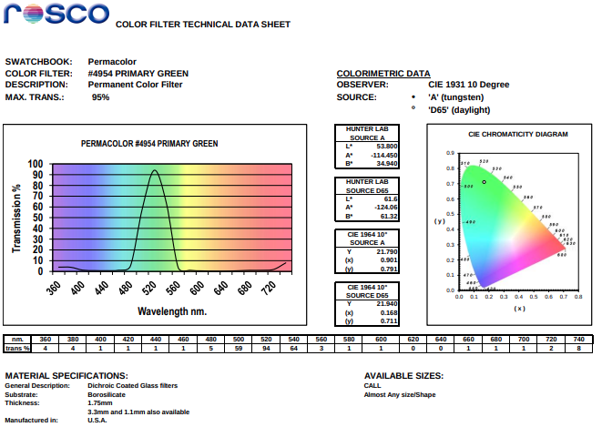
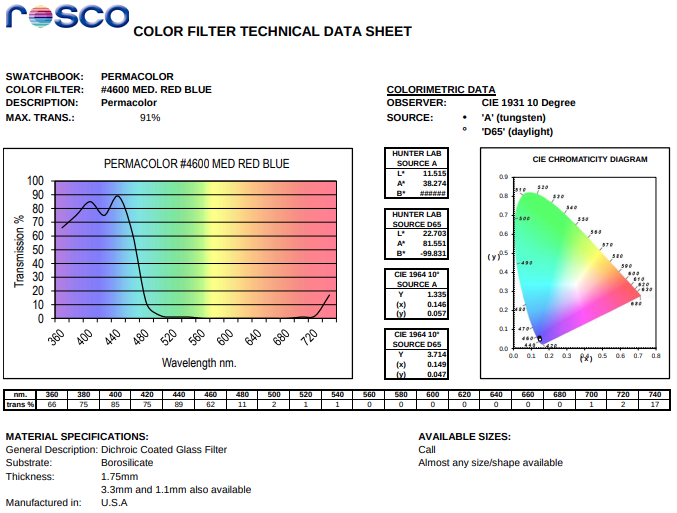

# Filters

Our goal is to illuminate the target with a narrow spectrum, and to filter out everything else from the camera.  The monochromatic LED illuminator
spectrum is pretty narrow, about 40nm, see the [emitters](emitters.md) doc for details.  Here's a typical emitter spectrum:

Ideally we'd like a filter that matches that narrow band, called a "bandpass" filter, like this.  The scales are a little different,
but you can still see how the LED peak from 500 to 550 nm just fits nicely inside the passband spanning the same range.

For blue, we could use a "shortpass" filter, since there's not much background below blue anyway:

Similarly, for red, we could use a "longpass" filter:

So what specific filters are available?

# Available options

There are many possibilities for filtering blue, green, or red illumination, and they vary enormously in cost.  There are two main types:

1. The least expensive color filter is a __[theater gel](https://en.wikipedia.org/wiki/Color_gel).__  These filters are called "gels"
because long ago they were made of gelatin, literally cast using baking sheets (and they still come in the baking sheet size)
today they're made of polycarbonate.  They work using dyes to __absorb__
the unwanted spectrum; they're intended to filter broad-spectrum illuminators into narrower bands, but they also work just as well
on the detector end.  Most gels are not particularly precise in spectrum terms, and many of them don't transmit very well in the passband.
There are __many__ gels to choose from, you can poke through them
[here](https://us.rosco.com/en/mycolor).  Many of them have low passband transparency, very gradual cutoffs, and pass multiple bands (e.g. it is
common for filters that appear blue to actually also pass red).  I've included examples of pretty good gels I found below.
2. The most precise filter is a __"dichroic" (Greek meaning "two color") filter.__ These work using layers of thin films to __reflect__
the unwanted spectrum (thus the name, they split one "color" from the other).  There are two sources for dichroic filters, industrial
optics manufacturers (designed for scientific purposes like fluorescence spectroscopy), and, again, theater lighting (dichroics are superior to dye
gels because they don't fade and they don't absorb heat).

# Red

Dye gel: [Roscolux 27, "Medium Red"](https://www.bhphotovideo.com/c/product/43960-REG/Rosco_RS2711_27_Filter_Medium.html)
$8 for almost 4 square feet. This gel has pretty good passband transparency, >85%, and a cut-off wavelength of about 650nm.

Dichroic gel: [Permacolor 6500 "Primary Red"](https://www.bhphotovideo.com/c/product/107002-REG/Rosco_120365007508_Permacolor_Primary_Red.html)
$16 for a 2 inch square (special order).  Notice the sharper cut-off at about 650 nm, and the higher transparency compared to the dye gel above.

# Green

Dye gel: [Roscolux 389, "Chroma Green"](https://www.bhphotovideo.com/c/product/44326-REG/Rosco_RS38911_Lighting_Filter_389_Chroma.html)
$8 for almost 4 square feet.  This filter has OK transmission in the passband, about 80% peak, with FWHM of about 480-560 nm,
and it's not entirely blocking in the yellow-red region.

Dichroic gel:
[Permacolor 4954 "Primary Green"](https://www.bhphotovideo.com/c/product/189992-REG/Rosco_120310867508_Permacolor_Industrial_Green.html)
$16 for 2 inch square, special order.  This filter is pretty close to ideal for our green LED source, passing about 500 to about 550, with
a peak transmission of over 90%, and almost nothing in the sidebands.

# Blue

Dye gel: [Roscolux 74 "Night Blue"](https://www.bhphotovideo.com/c/product/44490-REG/Rosco_RS7411_74_Filter_Night.html)
$8 for almost 4 square feet.  Notice the low transparency, about 50%, in the passband, centered around 470 nm, FWHM of about 440-500 nm.

Dichroic gel: [Permacolor 4600 "Medium Red Blue"](https://www.bhphotovideo.com/c/product/106985-REG/Rosco_120346007508_Permacolor_Medium_Red.html)
$16 for a 2 inch square (special order).  This filter has a sharper cut-off at about 450 nm, considerably
further towards the "blue" end of the spectrum than the dye gel above, and it passes __much__ more below 430, which the dye gel largely blocks.

