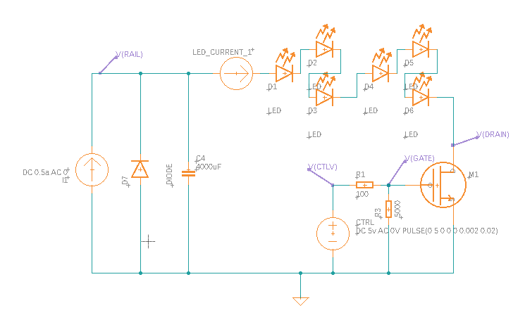

# Illuminator

The illuminator consists of TK main components:

1. __Emitters.__ There are many emitters available (see below for some of the options I discovered), but the best option seems to be
The [Cree XP-E2 Far Red emitter](https://cree-led.com/products/xlamp-leds-discrete/xlamp-xp-e2), which is available as 
a [three-emitter board for $12.](https://www.ledsupply.com/leds/cree-xlamp-xpe-high-power-led-star).  We'd use two per eye, 
four altogether. (This board actually includes the previous,
[discontinued](https://cree-led.com/media/documents/CREE-PCN-0731.pdf) version, XP-E,
which is slightly less bright; I've asked the supplier
about the new version, [announced](https://www.ledinside.com/node/32530) in January.)
2. __Power.__ The emitters are good for 1 amp continuous, but they can be driven harder at duty cycles less than 100%.  Cree provides
[detailed guidance on the topic of overdriving](https://cree-led.com/media/documents/XLampPulsedCurrent.pdf), which says that 3X current
is acceptable under 10% duty cycle, and 2X current is acceptable under 50%.  To provide enough power for 3X pulses, but limit the steady-state
power to a safe level, we use two components:
    1. A __current-limited DC converter,__ which takes the 10-12V available on the robot and produces a little under 24 volts,
    the maximum allowed by FRC rule R203.  The high voltage allows wiring all six LEDs in series, avoiding any issues with
    [hogging](https://luminusdevices.zendesk.com/hc/en-us/articles/6839791031437-Electrical-What-is-Current-Hogging-in-Series-Parallel-Designs-), a
    problem involving LED variation (some LEDs operate at lower voltage than others, and so take much more of the current, overloading them
    and making the others appear dim), and the thermal instability (more current yields higher temperatures which lowers resistance which
    permits even-higher current).  The current limit is set to 0.5a, nowhere near the maximum, to ensure safety in the case
    where the control is held on too long.  The converter uses the [SEPIC design](https://en.wikipedia.org/wiki/Single-ended_primary-inductor_converter),
    which is a form of [buck-boost converter](https://en.wikipedia.org/wiki/Buck%E2%80%93boost_converter), so we can use them for
    any voltage we need, whether it's above or below the source.  They're $6 each. :-)
    2. A simple __capacitor,__ to store enough charge to briefly drive the LEDs at the required 3 amps.  Suitable capacitors are available
    with screw terminals, which simplifies the wiring a bit; they're surprisingly expensive, around $20.
3. __Control.__  The cameras provide a signal, FSTROBE, which matches the shutter.  The illuminator should shine during this signal,
and not at other times.  A good motion-stopping shutter/strobe duration might be something around 1ms, and since the entire system only
needs to feed the robot at 50hz at the absolute maximum (less would be fine), the duty cycle is something below 10%.  For switching, we use
a simple NFET, available as a breakout board from Sparkfun.

The schematic above (available [here](https://truher.autodesk360.com/g/shares/SH35dfcQT936092f0e43a2d78fdfb23024ee)
for download) is really aimed at simulation, not exactly the correct components.  Simulation results are below:

TK 10%

TK 50%

# Emitter Choices

There are several options within the [Cree XP-E2](https://cree-led.com/media/documents/XLampXPE2.pdf) line

# Alternatives

There are certainly many possible alternatives designs for the illuminator:

1. The Limelight illuminator
[appears to use](https://www.chiefdelphi.com/t/ever-wondered-what-makes-a-limelight-2-tick/380418) 
one [AL8860 driver](https://www.diodes.com/part/view/AL8860/) for each pair of LEDs, using a custom printed circuit board.  The design above
is much simpler, and avoids fabrication of any kind. 
2. Something like a [Neopixel ring](https://www.adafruit.com/product/1643) would not be a good choice; neopixels are not particularly bright, and their
output spectrum doesn't match any convenient filter.
