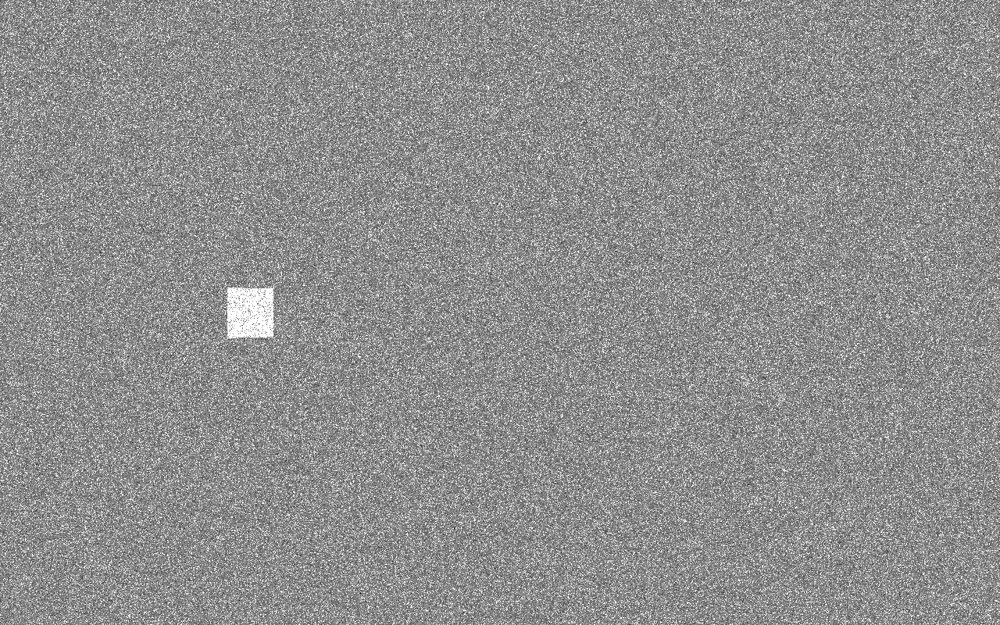
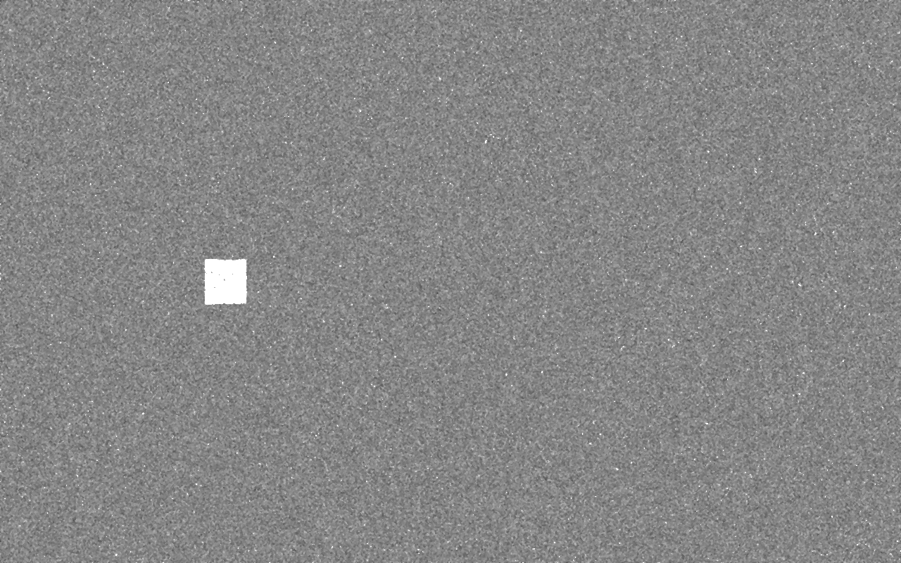
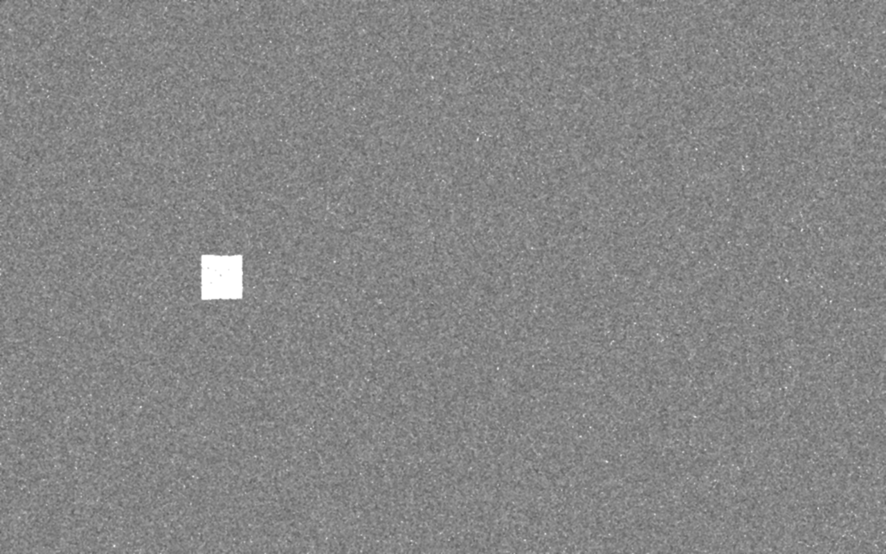
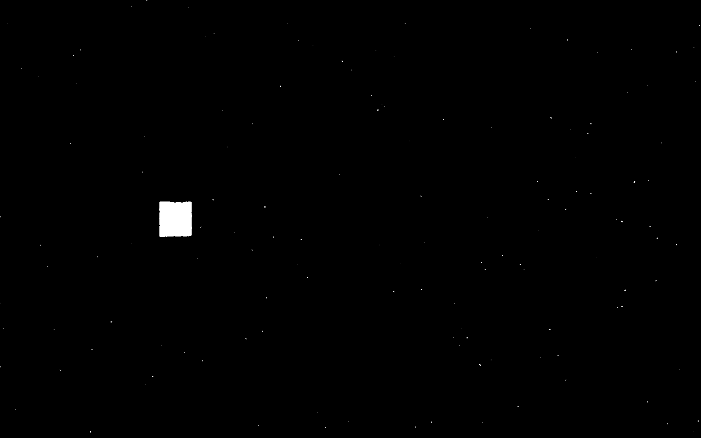

The image analysis process has several stages, illustrated here with synthetic images.
This example simulates a 0.5-meter square target, viewed with a 70-degree-FOV lens from about 8.5m distance, somewhat oblique on the left side.

The general idea is to use a monochromatic strobe and matching filter to create a high-contrast monochromatic image.

The raw image is a bright patch in a noisy field.
I'm not sure what the real background will look like, it will probably have more structure than this fine-grained noise.

The "salt and pepper" noise is removed with a median filter using `Imgproc.medianBlur()`.

The entire image is softened with a small Gaussian filter using `Imgproc.GaussianBlur()`.

The image is thresholded to pick out the brightest parts using `Imgproc.threshold()`.

Using `Imgproc.findContours()` results in a single squiggly box.

Any too-small contours are discarded and the remaining one is cleaned up with `Imgproc.approxPolyDP()`, which tries to fit a polygon with as few
vertices as possible.

To match the points in the image with the known points of the target, the points need to be sorted.  In this case, the path starts
in the upper left, and follows clockwise.  This path is produced with `Imgproc.convexHull()`.  The little black dots illustrate is where the points ended up.

The rest of the algorithm extracts a camera pose from those points, or two sets of similar points in the binocular case.
