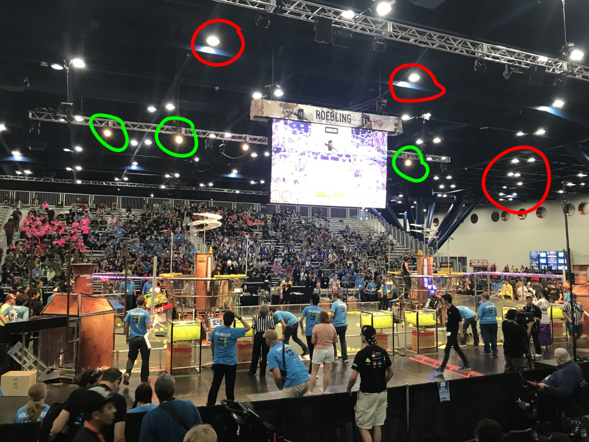

# Radiometry

The goal is to maximize the contrast of the target compared to the rest of the scene, so that the targets are easy to pick out
precisely.  Ideally the target would be white, and the
rest of the scene would be black.  To do that, we'll illuminate the target with a narrow spectrum, and then filter the reflected light
to select just that illumination prior to the camera.
So what wavelength is best?  How bright should the light be?  What will the image look like in the camera?

We should pick a wavelength with these characteristics:

1. Low background intensity, to maximize contrast; this is the part we want to be black.
2. High emission efficiency, so that the emitter can be bright without getting hot or requiring too many parts
3. High filter selectivity, to minimize off-spectrum input
4. High camera sensitivity, to minimize noise
5. No possibility of injury to skin or eyes
6. Avoids reduction of resolution caused by diffraction

There is some option value in choosing a wavelength that matches one of the colors in the typical Bayer mosaic; see below for details.

To quantify the goal of "maximizing contrast" we can quantify the foreground and background brightnesses.

## Spectra in general

To understand lighting spectra we first need to review what a spectrum represents.  Visible light is wave-like radiation
whose wavelength varies between about 400 and 700 nanometers (nm, billionth of a meter).  For comparison, 500 nm is about
the diameter of a bacterium: it's small, but it's not __that__ small.  The variation in wavelength corresponds to the colors
of the rainbow, from deep blue (400 nm) to deep red (700 nm).  These colors also indicate another aspect of light, which is
its particle-like nature: it is a stream of point-like particles that carry tiny amounts of energy.  Deep blue (400 nm) photons
have about 3 [electron volts](https://en.wikipedia.org/wiki/Electronvolt) (eV) of energy, deep red (700 nm) photons have about
1.7 eV.  An electron-volt is a truly tiny amount of energy, on the same scale as molecular bond energies.  There will be more
about photon energy below.

Most light sources contain a range of wavelengths.  If you
plot wavelength on the x axis and intensity on the y axis, you get a spectrum, for example the visible part of 
[sunlight](https://en.wikipedia.org/wiki/Sunlight) at the Earth's surface looks something like this:

The jaggedness in the spectrum is caused by absorption of specific wavelengths by molecules in the atmosphere, mostly ozone and water.

Another familiar spectrum is the old-fashioned [incandescent light bulb](https://en.wikipedia.org/wiki/Incandescent_light_bulb):

I'm sure you remember that incandescent light bulbs are inefficient, and from the spectrum you can see why: most of the watts
are in the invisible region beyond 700 nm ("infrared"), useless to our eyes.
It's actually worse than this picture shows, the spectrum is cut off here, there's
even more radiation in even longer waves, which we perceive as heat.

With this background in spectra, we can review the spectra of various sources at an FRC event.

## Background spectrum

FRC events are held in indoor basketball arenas and venues like the [Houston convention center](https://www.grbhouston.com/).  All these
locations are illuminated using overhead lighting, and some are also lit at an angle from the side, and/or (less commonly)
via windows to indirect sunlight.  It is not unheard of for gyms to allow __direct__ sunlight through a diffuser.

You can see the overhead fixtures below, circled in red, and the side-facing lights hanging from a truss, in green.

The picture shows that the overhead lights are "cool white" whereas the side-facing lights are "warm white" -- either or both might be
used in any specific venue.

The most common lighting technologies for this purpose would be [metal halide](https://en.wikipedia.org/wiki/Metal-halide_lamp)
or [white LEDs](https://en.wikipedia.org/wiki/LED_lamp#White_light_LEDs).  Since LEDs are more efficient, they are increasingly
common.  There are many spectra of common light sources
[here](https://www.apogeeinstruments.com/how-to-correct-for-spectral-errors-of-popular-light-sources/).

A metal halide lamp is a type of arc lamp that works by exciting metal ions, which then radiate in specific wavelengths.
The spectrum for metal halide varies by manufacturer and with the age of the bulb, but tends to look something like this:

Note the peaks in yellow and green, and the broad but low background that extends into infrared and near ultraviolet.

A white LED is a blue LED coated with one or more [phosphors](https://en.wikipedia.org/wiki/Phosphor) that absorb much of the blue light and radiate
a yellowish color.  A typical white LED spectrum looks like this:

Note the large, narrow blue peak, the much broader yellow peak, and the near-total absence of infrared.

This shows both the direct (sunshine) and indirect (blue sky) spectra of solar radiation:

The indirect spectrum is primarily blue, of course, and the direct spectrum contains an enormous amount of infrared: you can feel it
as heat.  Perhaps the gyms with windows also use infrared-blocking film, to reduce the energy used for air conditioning.  Let's assume
that's true.  See below for mitigations in case we're wrong.

To maximize contrast, we should choose a source wavelength that matches the minimum of the spectra above, in particular
the white LED spectrum, because it's the most likely.  The reasonable choices might be:

* About 500nm, corresponding to the dip between the blue and yellow peaks in the white LED spectrum -- this isn't the best choice, because the
dip is still half the yellow intensity, not near zero.
* Something short, like 420nm.  the problem with this choice is safety: bright blue and UV sources are hazardous, see below for details.
* Over 650nm.  all illuminators (except the sun) aim to minimize this, and all longer wavelengths.  This is the best choice.

## Background intensity

There are two cases of background intensity to quantify.

The first case of background intensity is caused by __reflection__ from objects illuminated with the overhead and side lighting.

To talk about reflection, we should first review the key photometric concepts with similar names:

* __[Illuminance](https://en.wikipedia.org/wiki/Illuminance)__ is the total amount of light that hits a surface, measured in
[lux](https://en.wikipedia.org/wiki/Lux).
* __[Luminance](https://en.wikipedia.org/wiki/Luminance)__ is the intensity of light produced per unit area per unit angle, measured
in lumens per steradian per square meter.  You can think of it as "brightness": if the same amount of light (lumens) comes from a smaller area,
that area seems brighter.  If the same amount of light is concentrated in a narrower cone, then it seems brighter.

For non-shiny surfaces, it's common to model [diffuse reflection](https://en.wikipedia.org/wiki/Diffuse_reflection)
as [Lambertian](https://en.wikipedia.org/wiki/Lambertian_reflectance), meaning
the luminance of the surface is the same no matter the angle of observation.  No real surface is Lambertian, but matte surfaces
are approximately so.  For this kind of surface, the
luminance is simply the product of the illuminance and [reflectance](https://en.wikipedia.org/wiki/Reflectance), divided by $\pi$:

$$
L_v = \frac{E_v R}{\pi}
$$

Back to FRC event lighting.  How much light is there?  [Common advice](https://tachyonlight.com/what-is-the-lighting-standard-of-basketball-court/)
and [the NCAA](https://www.ncaa.com/news/ncaa/article/2013-11-21/ncaa-best-lighting-practices) recommend lighting levels of 200-800 lux
on a horizontal plane (e.g. the floor), and, for televised events, 1000-2000 lux on a vertical plane (since TV cameras shoot from the side,
they want the side to be well lit).  I suspect that FRC events use a horizontal illuminance
level near the low end of the recommended range, since it's just what the gym has permanently installed.
I'm sure that FRC events don't use broadcast-level of vertical illuminance (it's shockingly bright), but some events do use some
side-facing light, as shown in the above picture of finals.  Let's assume 200 lux.

How much of the 200 lux is reflected?  Using the Lambertian reflection formula above, for a matte white surface, reflectance is 
[about 80%](https://www.engineeringtoolbox.com/light-material-reflecting-factor-d_1842.html), 
so a surface illuminated with 200 lux will reflect with a luminance of something like __50 lm/sr&middot;m2.__

The second case of background intensity is caused by __direct radiation from a light fixture in the camera frame.__  It's common
for FRC cameras to have an upward tilt, because targets are almost always high.  For example, in the 2022 game
the target was ~2.5 meters above the floor, and it was common to need to view it from 2.5 meters away or less,
so the camera was certainly looking at the ceiling.

So how bright are the ceiling fixtures?  A basketball court has an area of 437 square meters.  Illuminating
the whole court with 200 lux means about 90000 lumens total, divided into, say, 24 luminaires:

So each fixture is producing something like 3750 lumens, through roughly a 0.25 square meter aperture, within roughly a single steradian
angle.  So the luminance is very roughly __1000 lm/sr&middot;m2,__ which is __twenty times the luminance__ of the surfaces on the field.

## Emitter efficiency

Before we try to understand emitter or camera efficiency,
we should first review the key concepts from photometry and radiometry.  First, what's the difference
between radiometry and photometry?  Radiometry is concerned with the flow of __energy,__ whereas
photometry is concerned with __perception__: apparent brightness varies by wavelength, as described by the
[luminous efficiency function](https://en.wikipedia.org/wiki/Luminous_efficiency_function).  For bright light, the eye's response
is called [photopic](https://en.wikipedia.org/wiki/Photopic_vision), with this response curve:

The human eye is most sensitive around 555 nm, bright green, and doesn't perceive anything shorter than 400 or longer than 700.

The flow of light __energy__ is described using the term [radiant flux](https://en.wikipedia.org/wiki/Radiant_flux)
and measured in [watts](https://en.wikipedia.org/wiki/Watt).  The parallel concepts that involve __perception__ are
[luminous flux](https://en.wikipedia.org/wiki/Luminous_flux) and [lumens](https://en.wikipedia.org/wiki/Lumen_(unit)).  
For monochromatic light at 555 nm, one watt of radiation is defined to be exactly 683 lumens; that's the definition of a lumen.  for
wavelengths different from 555 nm, the lumens per watt is proportional to the photopic model, so that, for example, radiation at
620 nm (orange) only yields half as many lumens per watt, something like 300.

The reason we care about the distinction between watts and lumens is that visible light emitters are generally characterized
in lumens, because the common use case involves human perception.  But that's not our use case!  Our use case is __camera
perception__, which has a different luminous efficacy function than the human eye.  The camera response involves another
distinction we should review: the difference between [spectral sensitivity](https://en.wikipedia.org/wiki/Spectral_sensitivity)
and [quantum efficiency](https://en.wikipedia.org/wiki/Quantum_efficiency).  Spectral sensitivity measures the response
per unit __energy__, whereas quantum efficiency measures the response per __photon__.  (Recall from above that a photon is the
particle-like carrier of light energy.)  Camera
[image sensors](https://en.wikipedia.org/wiki/Image_sensor) work by counting photons, not by measuring photon energy.  Roughly, if an
inbound photon is above the minimum energy (about 1.1 eV, about 1100 nm), it gets counted: any extra energy simply heats the sensor a tiny bit.
The simple implication here is that, because blue light requires twice as much energy
to produce than red light, but the camera sensitivity to each is about the same, it's more efficient to use red light.  :-)

There are other factors that make typical CMOS detector quantum efficiency vary with wavelength.  This is the
quantum efficiency of the [OV9281/OV2311 sensor I suggest using](camera.md):

Notice that the detector response is much broader than the human eye response (note the larger x-axis range).  Where 
the human eye sees almost nothing at 700 nm, the detector quantum efficiency is around 80%!
The main reason for the decline at longer wavelengths is that a photon travels some distance in the detector before being
absorbed.  Longer wavelengths require longer distances to be absorbed, but the detector isn't very thick, so lots of
long-wave photons simply exit the sensitive region of the detector before being absorbed.

Cameras are typically characterized using quantum efficiency, but illuminators are characterized using lumens, so we need
to translate between them.

Now we can return to the question of emitter efficiency.

Emitter
Using the [Cree XP-E2](https://cree-led.com/media/documents/XLampXPE2.pdf) as a guide, there is a range of emitter efficiencies to choose from.

## Filter selectivity

## Camera sensitivity

## Safety

## Diffraction

## Bayer mosaic

Rather than using a monochrome camera, we could use an RGB camera and choose an illuminator that corresponds to one of the colors in
the usual [Bayer mosaic](https://en.wikipedia.org/wiki/Bayer_filter).  Here's the spectral response of for each of the
channels in the Sony IMX287 detector
in the [Flir Blackfly S](https://www.flir.com/products/blackfly-s-usb3/), a popular ($500) machine vision camera.

The overlapping, gently sloping filters mimic the overlapping, gently sloping response of the human eye: for example, the ratio of blue to green
response is how the wavelengths between blue and green are differentiated.  If the RGB channels were sharp bandpass filters, the
camera wouldn't produce anything useful at all: a cyan signal would be read as either completely blue or completely green depending on its
relationship to the blue/green divider.

To extract a high-contrast monochromatic signal from this detector, we could pick any color from
the normal result of [demosaicing](https://en.wikipedia.org/wiki/Demosaicing), at the cost of resolution
and the usual demosaicing artifacts.  Alternatively, we could illuminate with 570nm, where green is sensitive but neither red nor blue is, and
use the raw signal from the green channel.  We could also use the demosaiced signal for other purposes (e.g. object detection),
perhaps excluding the band around 570nm if it proves to be a distraction.

## Mitigating sunlight

